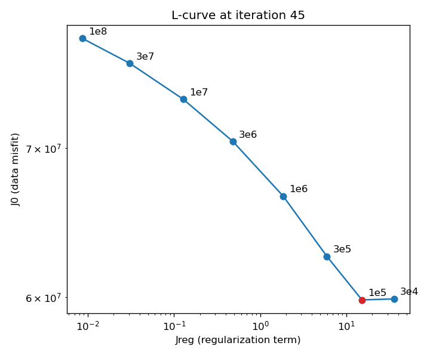

# Lambda choice: L-curve

Quantitative justification for Lambda=1e5, on top of the instability
threshold in line_search_diagnosis.md.

J0 = how far the modeled surface velocity is from the observed
(GPS/kriging) velocity. Jreg = how rough/uneven the optimized friction
field (alpha) is (squared norm of its spatial gradient). Cost minimized:
J = J0 + Lambda * Jreg.

Method: ran the inversion at 8 Lambda values (3.16e4 to 1e8, log-spaced),
niter=45 (past the ~iter 31 convergence plateau); reused the existing
confirmation run for the 1e5 point. J0 = data misfit (Cost_steady.dat).
Jreg = regularization term (CostReg_steady.dat) - this value does not
include Lambda; Lambda is only applied later, when building the gradient.

    Lambda    J0          Jreg
    1e4       diverges (unstable, see line_search_diagnosis.md)
    3.16e4    5.988e7     35.86
    1e5       5.982e7     15.21
    3.16e5    6.257e7     5.96
    1e6       6.659e7     1.85
    3.16e6    7.046e7     0.48
    1e7       7.360e7     0.13
    3.16e7    7.639e7     0.031
    1e8       7.839e7     0.0086

Reproduce with `python3 scripts/plot_lcurve.py` (reads each
lcurve/<tag>/ run directory - see ../running/parallel_runs.md for how those
runs were launched).

Reading it: between 3.16e4 and 1e5, Jreg drops by more than half while
J0 barely moves - free regularization. Past 1e5, J0 climbs steadily for
a shrinking Jreg return - the over-smoothing branch. The corner sits at
1e5, which is also the smallest stable Lambda (1e4 diverges) - both
criteria agree on the same value.
